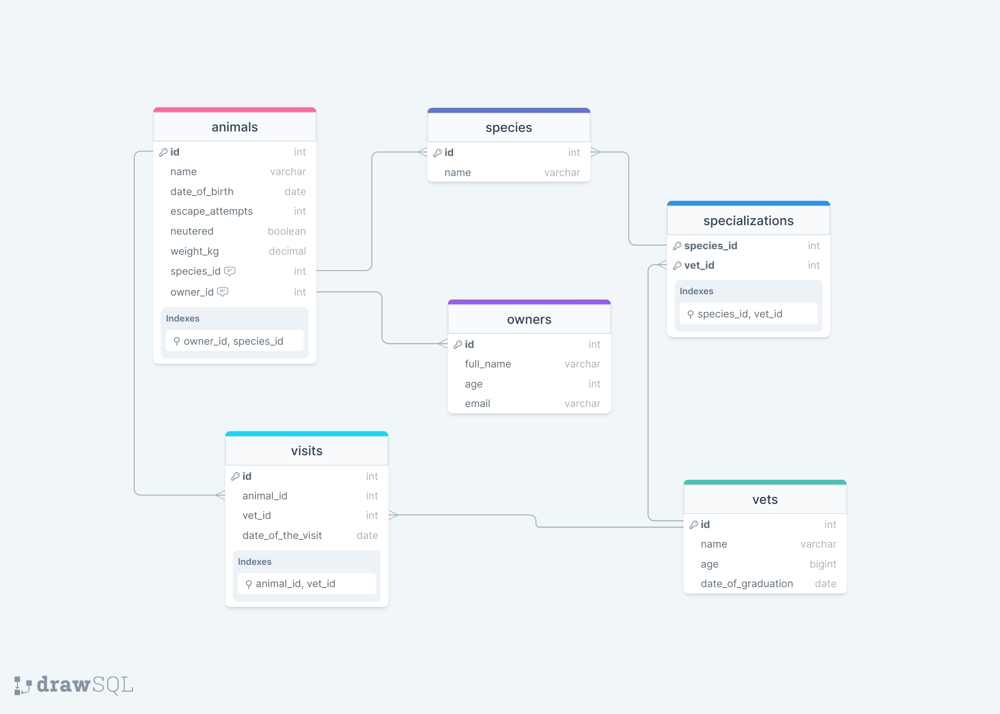

<a name="readme-top"></a>

<div align="center">

  
  <br/>

  <h3><b>Microverse README Template</b></h3>

</div>

# 📗 Table of Contents

- [📖 About the Project](#about-project)
  - [🛠 Built With](#built-with)
    - [Tech Stack](#tech-stack)
    - [Key Features](#key-features)
- [💻 Getting Started](#getting-started)
  - [Prerequisites](#prerequisites)
  - [Setup](#setup)
  - [Create database](#create-database)
- [👥 Author](#author)
- [🔭 Future Features](#future-features)
- [🤝 Contributing](#contributing)
- [⭐️ Show your support](#support)
- [🙏 Acknowledgements](#acknowledgements)
- [❓ FAQ](#faq)
- [📝 License](#license)

# 📖 Vet Clinic <a name="about-project"></a>

**Vet Clinic** is a project to create the initial data structure for a veterinary clinic using a relational database. It implements PostgreSQL and contains all the data about animals.

## 🛠 Built With <a name="built-with"></a>

### Tech Stack <a name="tech-stack"></a>

<details>
  <summary>Client</summary>
  <ul>
    <li><a href="https://www.postgresql.org/">PostgreSQL</a></li>
  </ul>
</details>

### Key Features <a name="key-features"></a>

- Create a database to store animals' information
- Insert some data into table, and query it

<p align="right">(<a href="#readme-top">back to top</a>)</p>

## 💻 Getting Started <a name="getting-started"></a>

### Prerequisites

In order to run this project you need:

- [PostgreSQL server](https://www.postgresql.org/download/) installed and running
- [psql](https://www.postgresql.org/docs/current/app-psql.html) installed

### Setup

Clone this repository to your desired folder:

```
git clone https://github.com/vvoo21/Vet-clinic.git
cd vet-clinic
```

### Create database

1. Connect to your PostgreSQL server with `psql`
```
> psql
postgres=#
```

2. Create the database `vet_clinic`
```
postgres=# CREATE DATABASE vet_clinic;
CREATE DATABASE
```

3. Connect to your database vet_clinic. Inside your current session do:
```
postgres=# \c vet_clinic
You are now connected to database "vet_clinic" as user "postgres".
vet_clinic=#
```

That's it! Congratulations, you have created your database and connected to it. Next, we will add a table.

- Use [schema.sql](./schema.sql) to create all tables.
- Use [data.sql](./data.sql) to populate tables with sample data.
- Check [queries.sql](./queries.sql) for examples of queries that can be run on a newly created database.

<p align="right">(<a href="#readme-top">back to top</a>)</p>

## Database Schema Diagram



## 👥 Author <a name="authors"></a>

👤 **Vanessa Oliveros Padron**

- GitHub: [@vvoo21](https://github.com/vvoo21)
- Twitter: [@vaneoliverosp](https://twitter.com/vaneoliverosp)
- LinkedIn: [vaneoliverosp](https://www.linkedin.com/in/vaneoliverosp/)

👤 **Amen Tetteh**

- GitHub: [@amentetteh](https://github.com/amentetteh)
- Twitter: [@amentetteh](https://twitter.com/amentetteh)
- LinkedIn: [amentetteh](https://www.linkedin.com/in/amentetteh/)


<p align="right">(<a href="#readme-top">back to top</a>)</p>

## 🔭 Future Features <a name="future-features"></a>

- Insert new data
- Update existence data
- Delete existence data

<p align="right">(<a href="#readme-top">back to top</a>)</p>

## 🤝 Contributing <a name="contributing"></a>

Contributions, issues, and feature requests are welcome!

Feel free to check the [issues page](../../issues/).

<p align="right">(<a href="#readme-top">back to top</a>)</p>

## ⭐️ Show your support <a name="support"></a>

Give a start if you like this project!

<p align="right">(<a href="#readme-top">back to top</a>)</p>

## 🙏 Acknowledgments <a name="acknowledgements"></a>

- I would like to thank the Microverse program!
- I would like to thank anyone whose code was used!

<p align="right">(<a href="#readme-top">back to top</a>)</p>

## 📝 License <a name="license"></a>

This project is [MIT](./LICENSE) licensed.

_NOTE: we recommend using the [MIT license](https://choosealicense.com/licenses/mit/) - you can set it up quickly by [using templates available on GitHub](https://docs.github.com/en/communities/setting-up-your-project-for-healthy-contributions/adding-a-license-to-a-repository). You can also use [any other license](https://choosealicense.com/licenses/) if you wish._

<p align="right">(<a href="#readme-top">back to top</a>)</p>
